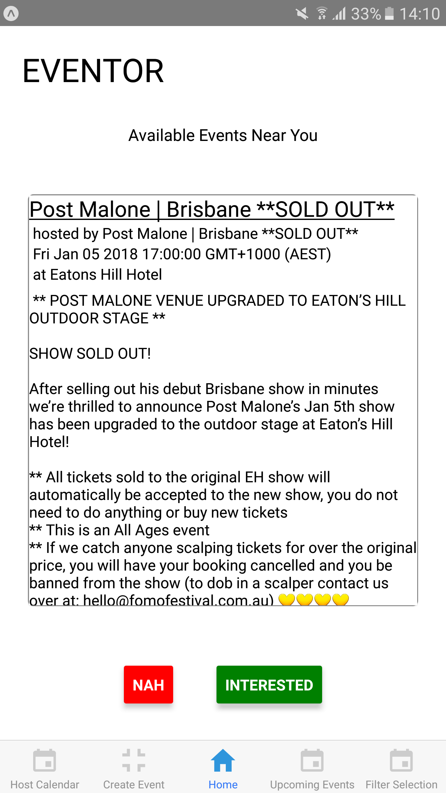
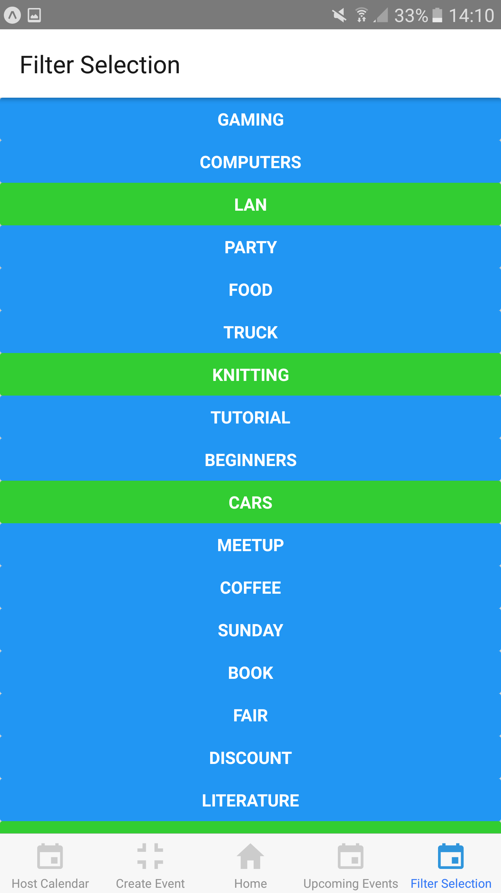
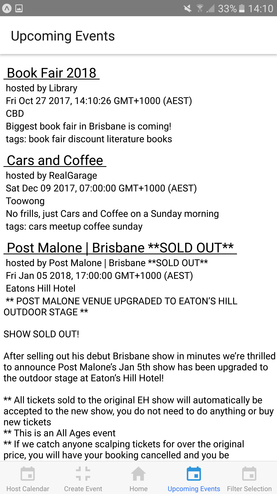
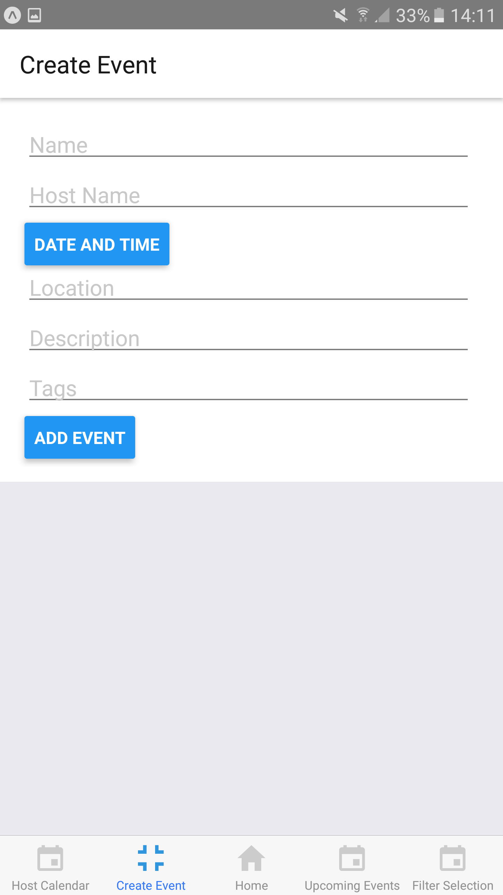
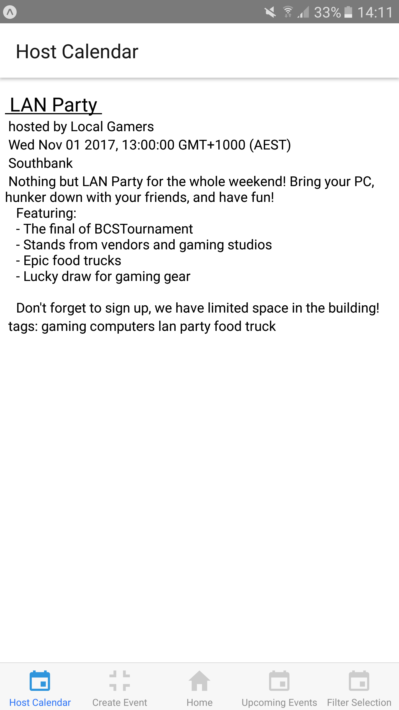

<h1>Eventor</h1>
[<h2>Promotional Website</h2>](http://eventor.uqcloud.net)

<h2>1. Introduction</h2>
<h3>1.1 Problem</h3>
In this day and age, smartphones and mobile applications have become a daily necessity in everyday life. Smartphone users would often rely on these mobile applications ranging from communication use to organisation use. This includes finding events for their recreational needs. However, often times people find it hard to find events that they like because of limited platforms that provides such information. Even social media platforms that do provide this often times does not give accurate results.

This becomes an inconvenience especially now that everything is fast-paced and instantaneous. In a world where everything is easily reachable with a touch of a screen, what makes an application stand out from its competitors is its ability to give the most easiest and comfortable service. And that is exactly what Eventor would like to achieve. Not only does Eventor suggests events based on the user’s location but it also filters out events in regards to the user’s interest so that they only get recommendation of events that they like. It is an application solely focused on connecting local social gatherings to potential attendees who are interested in those events but cannot find them due to not having the proper platform or merely because they do not know anyone in that community.

<h2>2. Concept</h2>

The core concept of Eventor is to provide users with suggestions of events that are being held nearby based on the interests that they have added for themselves. A user can be both an attendee or a host. The basic flow of the application is explained below.

1. As an attendee

The hompegae of the application is dedicated for suggestion of events for the user to choose whether they are interested or not. The events that shows up in the homepage will be based on the user's location and interest. Users have full control on which event to attend.

2. As a host

If a user wants to be a host, a separate page is provided for them to create an event which will be posted to the application for other users to see and attend. If another user expresses interest in the host's event, the host has the ability to accept or deny the attendee's interest to come. If the host accepts, full disclosure of the event's exact location will be shown in the event profile. The chat feature will also be available for the host and the attendee which would help the attendee communicate with the host. This would be incredibly helpful for the attendee if they are joining a whole new community.

However, if the host denies their request, the exact location will not be shown. This is extremely helpful especially if the event is conducted in the host's house.

Hosts has the ability to connect their application with their Facebook Page/profile. Events posted by them on Facebook can also be automatically added into Eventor. For example, if UQ Film Appreciation Society facebook page has posted an event on Facebook, this event will be added into their Eventor page and the host listed on Eventor will be the UQ Film Appreciation Society. This automation would hopefully help trigger loyalty from users to start actively adding events directly into Eventor now that they have a proper and more comfortable platform to use.

3. Public Events

Public events that are not hosted by a single individual are also promoted in the application. Public events are events in which people are expected to come without the need to be approved. An example of these events may include festivals, concerts and public competitions. For public events, attendees can directly choose attending or not attending. Once they do, they're ready to go. The exact location of the event is made available from the very start.

4. History

The more you check attend to all events you’re attending, the easier for the app to prioritize future events for your recommendation based on your history. This could encourage user's loyalty; as the more they use the app, the more they benefit from it.

4. Tags

Tags in Eventor is in form of interest. Both events and users can have tags. For example, user A can be interested in 'magic', 'music' and 'basketball'. An event called 'Marvel in GOMA' can have the tags 'superhero', 'comics'.

5. Interest

Users can change their interest whenever they want. For example, user A has 'books', 'spas' and 'basketball' as their tags (interest). However, after user A watched the movie Now You See Me, they are suddenly interested in 'magic'. User A can then add 'magic' into their list of tags and their homepage will then start suggesting events that has the tag 'magic' in them.

<h3>2.1 Aim</h3>

The aim of our project is essentially to suggest events to our users in a time-efficient way by extracting the user’s location and their interest. Not only that but through the flow of our application, Eventor aims to reduce the social gap by being the bridge between events and possible attendees and also possibly between hobby veterans and amateurs which would further encourage people to join new communities.

<h3>2.2 Audience</h3>

Our target audience is the general public, which extends to:
  1. Smartphone users who is looking for events nearby
  2. Smartphone users who is open to new communities
  3. Smartphone users who is planning on finding new communities

<h3>2.3 Difference between competitors</h3>

Competitors that our team has found related to our project are the applications Facebook Events, EventBrite and HeyLets. Facebook Events is a feature offered by Facebook which lists all active events that are being held or will be held nearest to the location of the user. EventBrite is an application that allows event organizers to plan, promote and sell tickets to events. HeyLets is an application that focuses on experiences that people enjoy and allow them to share it to the world and also matches users with relevant recommendation based on what they like.

| Eventor        | EventBrite             | Facebook Events  | HeyLets           |
| -------------- |------------------------| -----------------| ------------------|
| Suggestions of events are organized by the user's interest and location. User's will not be suggested events that they are not interested in and that are not in range with their current location.      | Instead of filtering the events based on interest, users are just given suggestions of all events in range with their wanted location or by the type of event. They will have to manually scroll until they find an event that is of interest to them.          | Suggestions are only organized by location. They will have to manually scroll until they find an event that is of interest to them. | Suggestions are based on other people’s recommendation with the same interest. |
| Interactive chat group will be automatically available for the user once their ‘Interest in attending the event’ is accepted. This chat group will be between the user and the event's host which will become an ‘icebreaker’ especially if the user is a newbie in that community.   | There is no chat feature.  |  There is a wall post for user to post in but is less personal. Personal chat messaging is available but only for those who the user is friends with. | There is a chat feature between the user and the person who posted their experience with the event. |
| Location of the event is only made available once the user's request to attend is accepted to ensure security. This is extremely helpful for events that are considerably small. | Location of the event is made available for everyone.    | Location of the event is made available for everyone.    | This option is not available. |
| The list of interests can be updated whenever the user wants to ensure flexibility. | This option is not made available.     | This option is not made available.    | This option is not made available. |
| The host has the choice to accept or decline a user's interest to attend the event. This will help hosts of smaller events to keep track of who's coming and be in complete control.  | This option is not available.              | This option is not available.         | This option is not made available. |
| The user has the choice to choose whether they are interested with the event or not.  | This option is available as ‘Register’ to the event. This would then lead the user to a scenario as if they’re buying a ticket.             | This option is available and is divided into three: interested, going or not interested.         | This option is available but the way it works is similar to ‘liking’ a post. |
| User’s interest can be updated regularly whenever the user wants to. For example, if a user is suddenly interested in a new hobby, basketball, they can add ‘basketball’ or ‘sports’ as their interest. The next time they open their homepage, suggestions for sports and basketball will show up in their recommendations. | This option is not available as EventBrite does not categorize their events based on ‘interest’. They do, however, categorize it based on event type. However, the  downside to this is that if the user chooses ‘Performance’ as the type of event they want to search through, all concerts ranging from Pop to Rock concerts will show up as the suggestions. This would be time consuming if all the user wanted to find was simply just Pop concerts.| This option is not available. | This option is available. |

<h2>3. Team</h2>

| Name          | Student Number         | Tasks  |
| ------------- |------------------------| -------|
| Raihan Saputra      | 44484060           | Help with developing low-fidelity and high-fidelity mockups. Conducting user testing and compiling the results.|
| Yohana Hadiati     | 44011859    |   Team Leader. Help with developing low-fidelity and high-fidelity mockups and creating the prototype using Marvel. |
| Yangjun Sun | 43803105    |   Help with developing low-fidelity and high-fidility mockups, also concentrate on the final prototype.  |
| Melanie Sinclair | 43205240     | UX evaluations, ensuring prototypes and testing are informed and purposeful.  |

<h2>4. Communication</h2>

Communication between members and task organisation will be done primarily through platforms such as Slack and Github. In Slack, we will uphold good communication among members of our team by using it as a platform to discuss problems or ideas pertaining our project. We will also use Slack as to constantly to deliver constructive feedback amongst team members about our/their work. If necessary, further deliberation will be done in our meeting which is held during our designated two-hour workshop held each Tuesday.

If conflict or disagreements arises in the group, we will do the following:
1. Discuss those problems, conflict, agreements as a team through Slack. If the problem persists that it requires a group meetup, the problem will be discussed either in the Workshop scheduled (every Tuesday) or at an agreed meetup location outside of class.
2. Discussions should yield an agreed consensus/solution.
3. Discussions should be documented through Slack.

If disagreements still cannot be resolved,
1. The team leader will be the one to make the decision for the team.

If it is still unresolved,
1. The team leader will consult with the tutor or the course staff who are available for advice and guidance.
2. If necessary, peer assessment will be requested.

File sharing will primarily be done through Github for version control as it is easy for us to keep track of all the changes done to our files and by whom those changes were done. But we will also use Google Drive to store our documentation needs under the name DECO3500 - Eventor. Our file naming convention will be Eventor_XX.

<h2>5. Plan</h2>

<h3>5.1 Project Phases</h3>

<h4>5.1.1 Research</h4>
Base user research is needed to set a baseline of usage of current available products, both from the side of the hosts and the attendants. We will conduct interviews to find out what are they using now, how are they using it, and what they feel to be lacking in the current solutions that are available.
With this info, we will create a more comprehensive comparison between the current solutions and what we want to build in Eventor.

<h4>5.1.2 Design and Testing</h3>
We will conduct an iterative design and testing workflow, in which we'll directly create a high-fidelity prototype, implementing few features to be tested in the iteration. After testing, we'll improve and implement more features to test further until we feel the results are satisfactory.

For the design and building of the prototypes, we'll be using Invision, as it's a platform that enables us to design and test easily. 

For testing, we'll be conducting usability tests with users, based on scenarios we think users will go through in the actual use off the app. We'll test with atleast 2 users each iteration, giving them tasks without direction and interview them after the testing.

<h4>5.1.2.3 Design Progress</h4>

Low fidelity designs have been created with a few different choices of possibilities. The best design will be chosen through user testing with Marvelapp to see which of the flows is the best one.

First choice: https://marvelapp.com/2hje99c
Second Choice: https://marvelapp.com/2aefc57

<h3>5.2 Resources

<h4>5.2.1 Designing Tools</h4>

The tools that we will be using in order to create our project are Adobe Illustrator in terms of designing and Adobe XD and Invisionapp/Marvelapp for our prototyping needs. Laptops and lab computers are also essential for our designing, prototyping proccess, documentation and creating promotional materials for our final presentation.

<h4>5.2.2 User Testing Tools</h4>

We will gather smartphone users for our user testing needs from different backgrounds, both socially and economically. The amount of people needed for this will be around 8 - 10 people.

<h3>5.3 Deliverables</h3>

<h4>5.2.1 Project Timeline (Milestone)</h4>

| Milestones          | Due Date         | 
| ------------------- | ---------------- | 
| Project Proposal    | 1 Sept 2017      |
| Design Iteration 1  | 4 Sept 2017 - 25 Sept 2017 |
| User Testing Iteration 1 | 25 Sept 2017 - 6 Oct 2017  |
| Design Iteration 2  | 2 Oct 2017 - 16 Oct 2017 |
| User Testing Iteration 2 | 18 Oct 2017 - 20 Oct 2017 |
| Final Refinements based on feedback | 20 Oct - 26 Oct 2017 |
| Promotional Materials | 16 Oct 2017 - 26 Oct 2017 |
| Design Prototype Final Presentation  | 27 Oct 2017      |

<h2>6. Documentation</h2>

<h3>6.1 Design Iteration 1</h3>

Based on the research done through the survey in https://goo.gl/forms/zJKFTlOHjzG1JBQj2, in our first design iteration our group has come up with the low fidelity designs for the application. The low fidelity screens that are created are the MVP features of the application which are grouped in the design1 folder in the Github. However, our team's focus for the user testing of this first design iteration is to determine which of the designs created fits the user the most. During this first iteration, our group has come up with two ways for the user to find their events. The first one would be a Tinder-like page for the user to use to scroll through events recommended based on their interest and location, but visually focuses on the event profile itself, shown below the tinder-like swipe cards and the list interface:

We decided on list view and card view because list view is used widely in the current and past web interactions such as Facebook Events, and card view is used because the interesting restrictions it imposed on the interaction of the event choices on the user as observed on Tinder. The big card interface displays all the related information in a clear way that is understandable through a quick glance. The restriction on only swiping on the displayed card instead of browsing through forces the user to make a decision whether they are interested in the displayed event to see another event that they might enjoy. Not only that, the cards provide a natural and consistent experience on different devices [1](https://thenextweb.com/dd/2015/11/16/why-cards-are-dominating-mobile-design/).

<h3>6.2 Design Iteration 2</h3>

Based on the user testing we have conducted for the first design iteration and the feedback we received from our potential users, we have decided to use the Card interaction compared to the list interaction. Users prefered the card interaction compared to the list interaction because the card provides more information about the event whereas the list interaction only provides minimum information due to space restrictions. 

<h3>6.3 Interactive Prototype</h3>

This prototype is meant to represent the interactivity that we want on the final product, including the swipe cards the ability to select interest (through tags), see events that the user is interested in, the ability to create events on the platform and see the list of created events.

The prototype is built on React Native to use the native interactions that are available on mobile platforms. It was built with the Expo XDE (Experience Design Environment) to speed up testing. The code theoritically should be able to run on both Android and iOS but testing revealed the prototype only works as expected on Android

The prototype can be tested on your own phone by downloading the Expo app and scan the QR code below or through [this link](https://expo.io/@rraihansaputra/eventor).

The code for the prototype is available in the eventor-prototype submodule.

<h2>7. Tags</h2> 

#awareness, #socialmedia, #community, #socialmobile, #eventlocator, #collaboration, #appropriation
